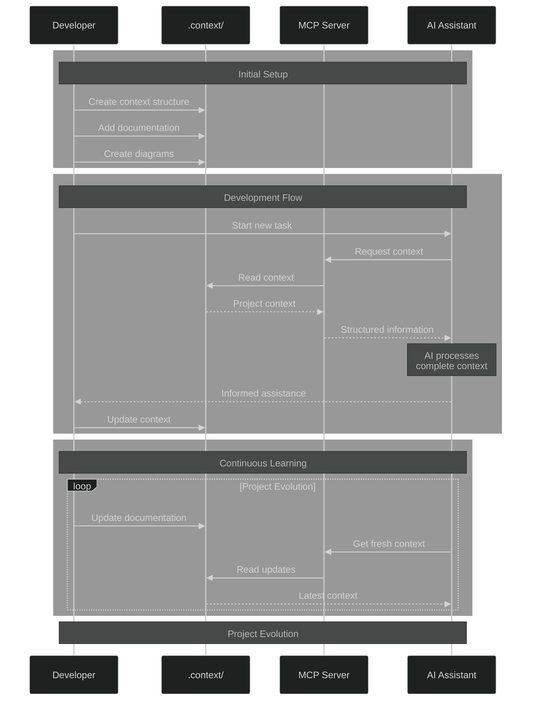

# dotcontext 📚
[](https://badge.fury.io/js/dotcontext)

AI coding has evolved from simple file-level completions to sophisticated project-wide assistance. As these tools become more capable, they need more context - not just about individual files, but about your project's architecture, history, and design decisions.

dotcontext emerged from a common pattern: developers repeatedly sharing README files with AI assistants to help them understand projects before starting tasks. We've standardized this approach into a structured system that helps AI coding agents grasp your codebase's full context from the start.




## What is Model Context Protocol (MCP)? 🤔

MCP is a communication standard that lets AI Coding Agents understand your codebase better. Think of it like a translator between your documentation and AI assistants. When an AI tool supports MCP, it can:

- Read and understand your project's documentation
- Parse architectural diagrams
- Make informed suggestions about your code
- Validate documentation structure

## Quick Start 🚀

### 1. Install and Initialize
```bash
# Navigate to your project root
cd your-project

# Create your first context directory
npx dotcontext init

# Validate your context structure
npx dotcontext validate
```

### 2. Configure MCP Server 🔌

#### For most environments:
```json
{
  "mcpServers": {
    "dotcontext": {
      "command": "npx",
      "args": ["-y", "-p", "dotcontext", "dotcontext-mcp"],
      "disabled": false,
      "alwaysAllow": []
    }
  }
}
```

#### For Windows users (resolves 'spawn NOENT' errors):
```json
{
  "mcpServers": {
    "dotcontext": {
      "command": "node",
      "args": ["C:/Program Files/nodejs/node_modules/npm/bin/npx-cli.js", "-y", "-p", "dotcontext", "dotcontext-mcp"],
      "disabled": false,
      "alwaysAllow": []
    }
  }
}
```

## Features 🛠️

### MCP Tools
- `init`: Create new context directories
- `validate`: Check documentation structure
- 💡 `context`: Get project documentation and insights
  > **AI Assistant Tip**: Use this command to understand a project before starting tasks!
  > ```
  > Custom Instruction: "use dotcontext's context to understand this project before starting on your task"
  > ```
- `diagrams`: View architectural diagrams

All tools automatically work from your project root, looking for a `.context` directory.

### Project Structure
Your `.context` directory organizes project knowledge:
- `index.md`: Main entry point for AI tools
- `docs/`: Documentation and references
- `diagrams/`: Architectural and flow diagrams
- `.contextignore`: Excludes irrelevant information

### CLI Tools
- Initialize context directories (`dotcontext init`)
- Validate documentation structure (`dotcontext validate`)
- List architectural diagrams (`dotcontext diagrams`)
- Lint context files for consistency

## Common Use Cases 📋

- **Legacy Projects**: Document historical context and system changes
- **Architecture Decisions**: Explain design patterns and trade-offs
- **Tribal Knowledge**: Capture team conventions and practices
- **Migration Notes**: Track system transitions (e.g., queue system → topic system)

## Technical Details ⚙️

- Built with TypeScript for type safety
- Automated versioning via Semantic Release
- Modular architecture for extensibility
- Comprehensive test coverage

## Learn More 📖

- 📺 [CCS Introduction Video](https://youtu.be/6icquh4thCw)
- 📄 [CCS RFC on SubStack](https://agenticinsights.substack.com/p/codebase-context-specification-rfc)
- 📚 [CCS GitHub Repository](https://github.com/Agentic-Insights/codebase-context-spec)
- 🌐 [Official Website](https://codebasecontext.org)

## Development 👩‍💻

### Setup
```bash
# Install dependencies
npm install

# Build project
npm run build

# Link for local development
npm link
```

### Testing
```bash
# Run tests
npm test

# Run with coverage
npm run test:coverage
```

## Contributing 🤝

We welcome contributions! Please check our contribution guidelines and maintain test coverage for new features.

## License 📄

MIT
